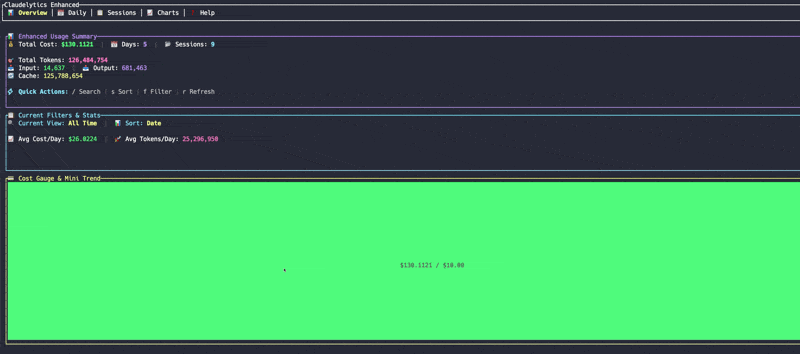

# Claudelytics

> ⚠️ **BETA SOFTWARE**: This is pre-release software under active development. Features may change, and bugs may exist. Please report issues on GitHub.

[](https://github.com/nwiizo/claudelytics/actions/workflows/ci.yml)
[](https://opensource.org/licenses/MIT)

A fast, parallel Rust CLI tool for analyzing Claude Code usage patterns, token consumption, and costs. Get comprehensive insights into your Claude Code usage with beautiful table outputs, interactive session browsers, advanced TUI interfaces, real-time monitoring, and seamless shell integration.



## ✨ Features

### Core Analytics
- **📊 Daily Reports**: Analyze usage patterns by day with token counts and costs
- **📈 Session Reports**: Break down usage by individual Claude Code sessions  
- **💰 Cost Tracking**: Quick cost summaries for today, specific dates, or totals
- **🔍 Flexible Filtering**: Filter data by date ranges with `--since` and `--until`

### Interactive & Real-time
- **🎯 Interactive Mode**: peco-style fuzzy searchable session selector
- **🎨 Enhanced TUI**: Full-featured terminal interface with 5 tabs and navigation
- **🚀 Advanced TUI**: Professional-grade analytics with 9 tabs, drill-down, comparison, and live monitoring
- **👀 Watch Mode**: Real-time monitoring with automatic updates
- **⚡ Today Filter**: `--today` flag for quick current day analysis

### Export & Integration
- **📄 Export Functions**: CSV export for daily, session, and summary reports
- **⚙️ Configuration**: YAML-based config file support for persistent settings
- **🐚 Shell Integration**: Bash, Fish, and Zsh aliases and functions
- **🎨 Multiple Formats**: Beautiful table view, enhanced cards, or JSON output

### Performance & UX
- **🚀 Fast Performance**: Parallel processing for large datasets using rayon
- **🎨 Enhanced UX**: Colored output, progress indicators, and helpful error messages
- **🛡️ Robust**: Comprehensive error handling with context-aware messages

## 🚀 Installation

### From Crates.io (Recommended)

```bash
# Install directly from crates.io
cargo install claudelytics
```

📦 **Crates.io**: https://crates.io/crates/claudelytics

### From Source

```bash
# Clone the repository
git clone https://github.com/nwiizo/claudelytics.git
cd claudelytics

# Build release version
cargo build --release

# Install to system (requires ~/.cargo/bin in PATH)
cargo install --path .

# Or copy binary to a directory in your PATH
sudo cp target/release/claudelytics /usr/local/bin/
```

### Quick Install Script

```bash
# Download and run install script
curl -fsSL https://raw.githubusercontent.com/nwiizo/claudelytics/main/install.sh | bash
```

### Prerequisites

- Rust 1.70+ and Cargo
- Claude Code installed and used at least once (creates `~/.claude` directory)

## 📋 Quick Start

```bash
# Show today's cost
claudelytics cost --today

# Interactive session browser
claudelytics interactive

# Enhanced TUI interface
claudelytics tui

# Advanced TUI with professional features
claudelytics advanced-tui

# Today's usage report
claudelytics --today

# Watch real-time usage
claudelytics watch

# Export all data to CSV
claudelytics export -o reports
```

## 📖 Usage

### Basic Commands

```bash
# Show daily usage report (default)
claudelytics daily

# Show session-based usage report
claudelytics session

# Interactive session selector (peco-style)
claudelytics interactive

# Real-time monitoring
claudelytics watch

# Terminal User Interface
claudelytics tui                    # Enhanced TUI (5 tabs)
claudelytics --tui                  # Alternative flag
claudelytics advanced-tui           # Advanced TUI (9 tabs with professional features)
claudelytics --advanced-tui         # Alternative flag

# Cost summaries
claudelytics cost
claudelytics cost --today
claudelytics cost --date 20241201

# Export to CSV
claudelytics export --daily --sessions --summary

# Configuration management
claudelytics config --show
claudelytics config --set-path /path/to/claude

# Get help
claudelytics --help
```

### Date Filtering

```bash
# Show usage since January 1, 2024
claudelytics daily --since 20240101

# Show usage until January 31, 2024
claudelytics daily --until 20240131

# Show usage for a specific date range
claudelytics daily --since 20240101 --until 20240131

# Show only today's data
claudelytics --today
claudelytics daily --today
claudelytics session --today
```

### Output Formats

```bash
# Enhanced format with visual summaries (default)
claudelytics daily
claudelytics session

# Classic table format
claudelytics daily --classic
claudelytics session --classic

# JSON output
claudelytics daily --json
claudelytics session --json

# CSV export
claudelytics export --daily -o daily_report.csv
claudelytics export --sessions -o sessions_report.csv
claudelytics export --summary -o summary_report.csv
```

### Custom Configuration

```bash
# Use custom Claude directory
claudelytics daily --path /custom/path/to/.claude

# Set default Claude path
claudelytics config --set-path /custom/path/to/.claude

# Show current configuration
claudelytics config --show

# Reset to defaults
claudelytics config --reset
```

## 🎨 TUI Interfaces

### Enhanced TUI (`claudelytics tui`)


A full-featured terminal interface with:

- **📊 Overview Tab**: Enhanced summary with quick stats and visual elements
- **📅 Daily Tab**: Color-coded daily usage with sorting and filtering
- **📋 Sessions Tab**: Searchable session analytics with real-time filter
- **📈 Charts Tab**: ASCII charts, cost trends, and token usage visualization  
- **❓ Help Tab**: Comprehensive help with keyboard shortcuts

**Navigation:**
- Use `1-5` keys or `Tab`/`Shift+Tab` to switch tabs
- Use `j/k` or arrow keys to navigate tables
- Press `/` to search, `s` to sort, `f` to filter by time
- Press `r` to refresh, `e` to export, `c` to clear status
- Press `?` for quick help popup, `q` or `Esc` to quit

### Advanced TUI (`claudelytics advanced-tui`)
Professional-grade analytics interface with all Enhanced TUI features plus:

- **🔍 Drill-Down Tab**: Message-level analysis with efficiency metrics
- **⚖️ Compare Tab**: Side-by-side session comparison and analysis
- **🏆 Benchmark Tab**: Performance rankings and optimization recommendations
- **🔴 Live Tab**: Real-time monitoring with sparklines and activity tracking
- **📊 Charts Tab**: Advanced visualizations, heatmaps, and usage patterns

**Advanced Features:**
- **🎯 Command Palette**: Press `Ctrl+P` for quick action access with fuzzy search
- **🔖 Bookmark System**: Press `b` to bookmark important sessions
- **📊 Session Detail**: Press `d` to drill down into message-level analysis
- **⚖️ Session Comparison**: Press `x` to add sessions to comparison
- **🔴 Live Mode**: Press `l` to toggle real-time monitoring
- **📁 Smart Export**: Export comparison reports and detailed analytics

## 🐚 Shell Integration

### Quick Setup

Add these aliases to your shell config file:

#### Bash (~/.bashrc or ~/.bash_profile)

```bash
# Claudelytics aliases
alias ctoday='claudelytics cost --today'
alias csum='claudelytics cost'
alias cwt='claudelytics --today'
alias cwatch='claudelytics watch'
alias cint='claudelytics interactive'
alias ctui='claudelytics tui'
alias catui='claudelytics advanced-tui'

# Function to check cost for specific date
cdate() {
    if [ $# -eq 0 ]; then
        echo "Usage: cdate YYYYMMDD"
        return 1
    fi
    claudelytics cost --date "$1"
}

# Quick daily summary
cdaily() {
    echo "📊 Claude Usage Summary"
    claudelytics cost --today
    echo ""
    claudelytics --today
}
```

#### Fish (~/.config/fish/config.fish)

```fish
# Claudelytics aliases
alias ctoday='claudelytics cost --today'
alias csum='claudelytics cost'
alias cwt='claudelytics --today'
alias cwatch='claudelytics watch'
alias cint='claudelytics interactive'
alias ctui='claudelytics tui'
alias catui='claudelytics advanced-tui'

# Function to check cost for specific date
function cdate
    if test (count $argv) -eq 0
        echo "Usage: cdate YYYYMMDD"
        return 1
    end
    claudelytics cost --date $argv[1]
end

# Quick daily summary
function cdaily
    echo "📊 Claude Usage Summary"
    claudelytics cost --today
    echo ""
    claudelytics --today
end
```

#### Zsh (~/.zshrc)

```zsh
# Claudelytics aliases
alias ctoday='claudelytics cost --today'
alias csum='claudelytics cost'
alias cwt='claudelytics --today'
alias cwatch='claudelytics watch'
alias cint='claudelytics interactive'
alias ctui='claudelytics tui'
alias catui='claudelytics advanced-tui'

# Function to check cost for specific date
cdate() {
    if [[ $# -eq 0 ]]; then
        echo "Usage: cdate YYYYMMDD"
        return 1
    fi
    claudelytics cost --date "$1"
}

# Quick daily summary
cdaily() {
    echo "📊 Claude Usage Summary"
    claudelytics cost --today
    echo ""
    claudelytics --today
}
```

### After Setup - Quick Commands

```bash
ctoday          # Today's cost
csum            # Total cost summary
cdate 20241201  # Specific date cost
cwt             # Today's full report
cint            # Interactive session browser
ctui            # Enhanced TUI interface
catui           # Advanced TUI with professional features
cwatch          # Real-time monitoring
cdaily          # Quick daily summary
```

## 📊 Output Examples

### Enhanced Daily Report (Default)

```bash
$ claudelytics daily
📊 Claude Code Usage Analytics
🕐 Generated at 2024-12-01 14:30:15

────────────────────────────────────────────────────────────
│  💰 Total Cost: $4.90  │  📅 Days: 3  │  🎯 Total Tokens: 35,500
│  📥 Input: 10,000  │  📤 Output: 20,000  │  🔄 Cache: 5,500
────────────────────────────────────────────────────────────

🚀 Recent Activity
► 2024-12-01 │ 18,000 tokens │ $2.45
  2024-11-30 │ 10,500 tokens │ $1.50
  2024-11-29 │ 7,000 tokens │ $0.95

📋 Daily Usage Details
📅 2024-12-01
  💰 Cost: $2.45 │ 🎯 Tokens: 18,000 │ 📊 Ratio: 2.0:1
  📥 In: 5,000 │ 📤 Out: 10,000 │ 🔄 Cache: 3,000

📋 2024-11-30
  💰 Cost: $1.50 │ 🎯 Tokens: 10,500 │ 📊 Ratio: 2.0:1
  📥 In: 3,000 │ 📤 Out: 6,000 │ 🔄 Cache: 1,500
```

### Cost Summary

```bash
$ claudelytics cost --today
💰 Today's Usage Cost
Date: 2024-12-01
Cost: $2.45
Tokens: 12,450
```

### Interactive Mode

```
📊 Claude Session Selector (ESC/q: quit, Enter: select)
🔍 Query: 
────────────────────────────────────────────────────────────
► project-1/feature-implementation
  📝 In: 1,245 | 📤 Out: 2,103 | 💰 $0.42

  project-2/bug-fixes
  📝 In: 891 | 📤 Out: 1,567 | 💰 $0.31

  project-3/documentation
  📝 In: 567 | 📤 Out: 1,234 | 💰 $0.23
```

### Watch Mode

```bash
$ claudelytics watch
🔍 Starting watch mode...
👀 Monitoring: /Users/user/.claude
Press Ctrl+C to stop

🕐 Last updated: 2024-12-01 14:30:15
────────────────────────────────────────────────────────────────────────────────
[Daily usage table updates in real-time]
────────────────────────────────────────────────────────────────────────────────
```

## 📁 Data Structure

Claudelytics analyzes Claude Code data stored in this structure:

```
~/.claude/
└── projects/
    ├── project-name-1/
    │   ├── session-abc123/
    │   │   └── chat_2024_01_01.jsonl
    │   └── session-def456/
    │       └── chat_2024_01_02.jsonl
    └── project-name-2/
        └── nested/
            └── path/
                └── session-ghi789/
                    └── chat_2024_01_03.jsonl
```

### JSONL Record Format

Each line should contain:

```json
{
  "timestamp": "2024-01-01T12:34:56Z",
  "message": {
    "usage": {
      "input_tokens": 1000,
      "output_tokens": 2000,
      "cache_creation_input_tokens": 500,
      "cache_read_input_tokens": 300
    }
  },
  "costUSD": 0.15
}
```

## ⚙️ Configuration

Claudelytics uses a YAML configuration file at `~/.config/claudelytics/config.yaml`:

```yaml
claude_path: /custom/path/to/.claude
default_output_format: Table  # or Json
default_command: Daily        # Daily, Session, or Interactive
watch_interval_seconds: 5
export_directory: ~/Reports
date_format: "%Y-%m-%d"
```

```bash
# View current configuration
claudelytics config --show

# Set custom Claude path
claudelytics config --set-path /path/to/.claude

# Reset to defaults
claudelytics config --reset
```

## 🚀 Performance

- **Parallel Processing**: Handles 10,000+ JSONL files efficiently using rayon
- **Memory Optimized**: Low memory footprint for large datasets
- **Fast Startup**: Quick initialization and response times
- **Real-time Updates**: Efficient file watching with minimal CPU usage

## 🛠️ Development

### Prerequisites

- Rust 1.70+ 
- Cargo

### Building

```bash
# Clone repository
git clone https://github.com/nwiizo/claudelytics.git
cd claudelytics

# Build debug version
cargo build

# Build release version
cargo build --release

# Run tests
cargo test

# Format code
cargo fmt

# Check formatting
cargo fmt --check
```

### Running from Source

```bash
# Development build
cargo run -- daily --help

# Release build
cargo run --release -- session --json

# Run specific commands
cargo run -- cost --today
cargo run -- interactive
cargo run -- tui
cargo run -- advanced-tui
cargo run -- watch
```

**Note:** Building may show some warnings about unused code in advanced TUI features. These are from planned features that are partially implemented and will be completed in future releases.

## 🐛 Troubleshooting

### Common Issues

| Issue | Solution |
|-------|----------|
| "Claude directory not found" | Ensure Claude Code is installed and used at least once |
| "No usage data found" | Check date range and verify JSONL files exist |
| "Invalid date format" | Use YYYYMMDD format (e.g., 20240101) |
| "Permission denied" | Ensure read access to Claude directory |
| "Command not found" | Ensure claudelytics is in PATH or use full path |

### Build Warnings

The project currently has minor compiler warnings about unused imports in the advanced TUI module. These are safe to ignore as they relate to planned features that will be implemented in future versions.

### Exit Codes

- `0`: Success
- `1`: General error  
- `2`: CLI usage error
- `3`: File system error

## 🤝 Contributing

1. Fork the repository
2. Create a feature branch (`git checkout -b feature/amazing-feature`)
3. Make your changes
4. Run tests (`cargo test`)
5. Format code (`cargo fmt`)
6. Commit changes (`git commit -m 'Add amazing feature'`)
7. Push to branch (`git push origin feature/amazing-feature`)
8. Open a Pull Request

## 📄 License

This project is licensed under the MIT License - see the [LICENSE](LICENSE) file for details.

## 🙏 Acknowledgments

- Built with ❤️ in Rust
- Inspired by the need for better Claude Code usage analytics
- Thanks to the Rust community for excellent crates and tools
